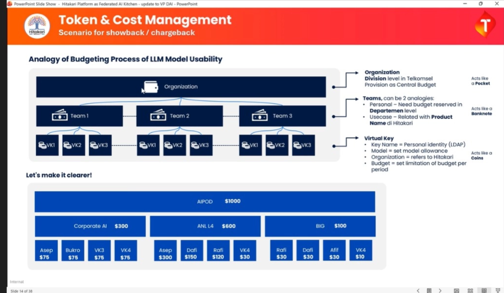
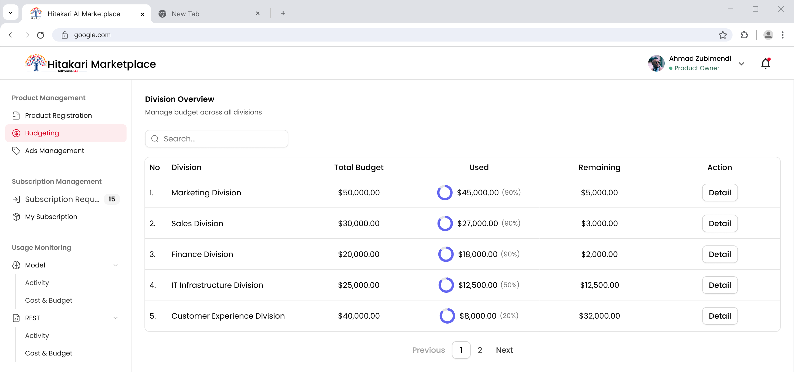
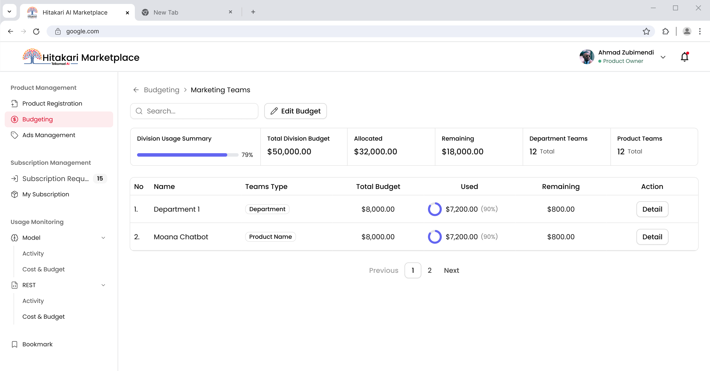
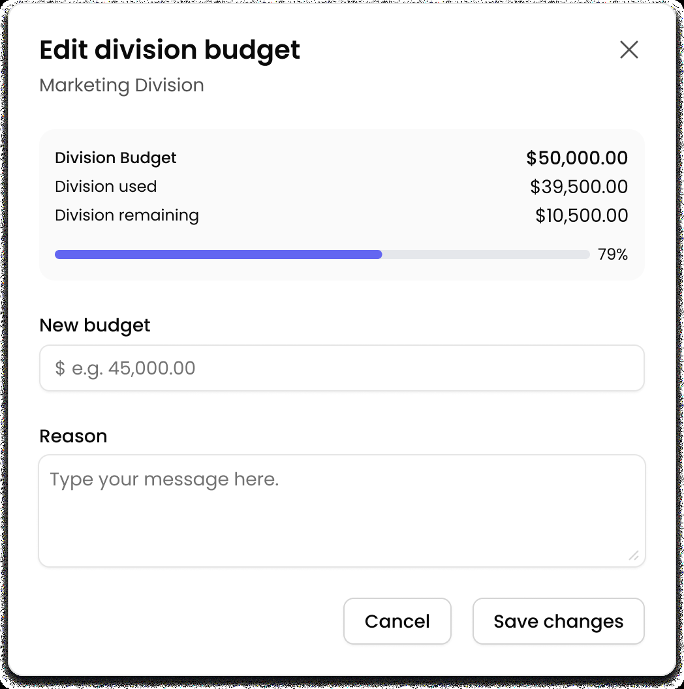
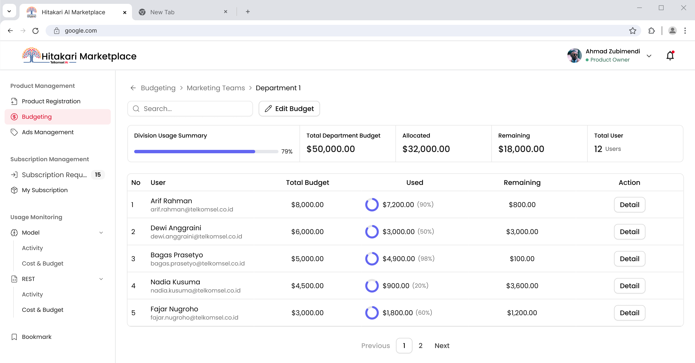
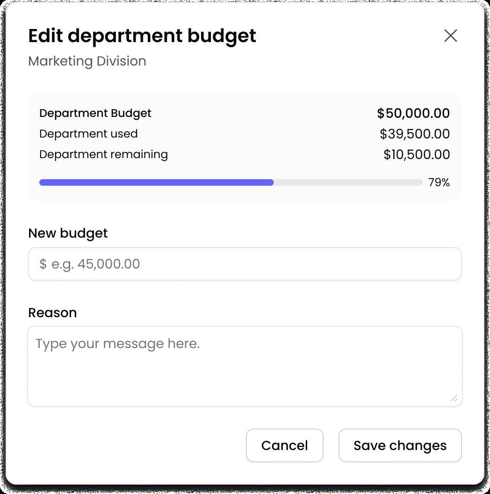
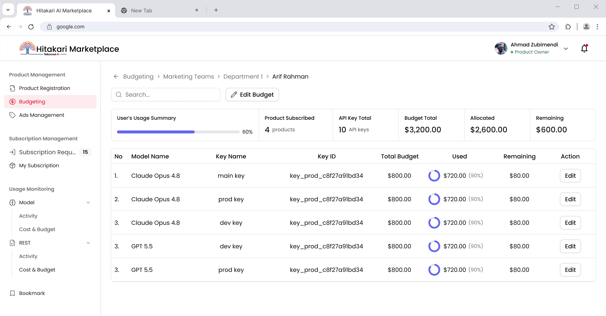
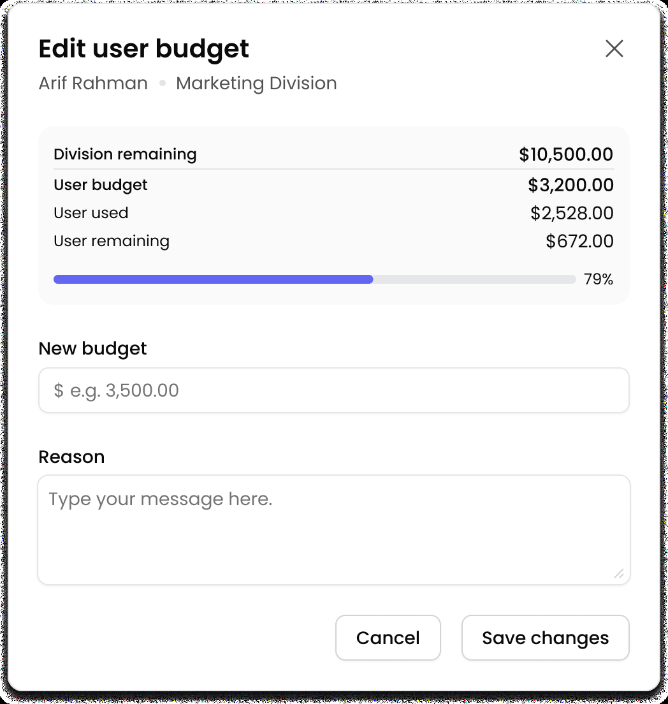
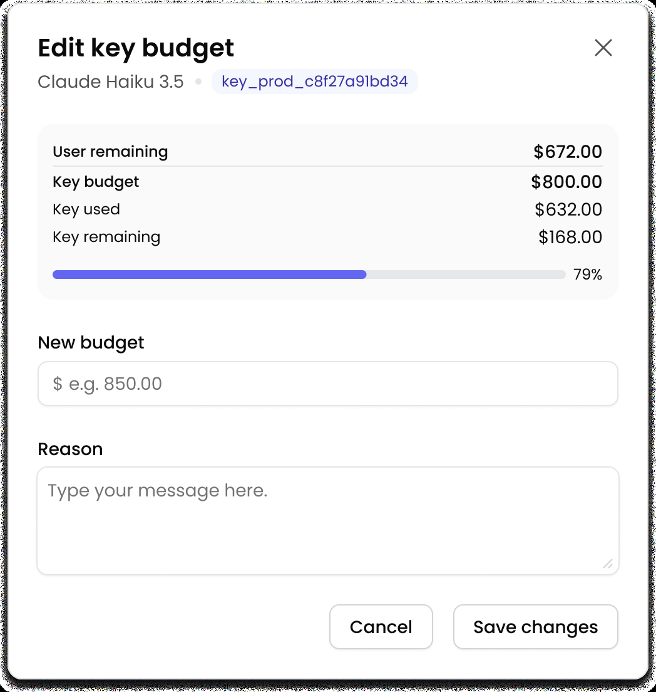

# Budgeting Menu — Spec

## Context

I need to build a new menu called **Budgeting**. This menu manages how budget is arranged and distributed across the organization — similar to a "pocket/shared budget" system. This menu is **Super Admin only**.

### Hierarchy (top to bottom)

1. **Organization (Division)** — the system displays all divisions that have already been registered.
2. **Teams** — the umbrella/category level under a division. Entering a division shows its "Teams" page (breadcrumb label: `[Division Name] Teams`, e.g. `Marketing Teams`). Each individual team belongs to one of 2 types:
   - **Department** — a team type. Budget for individual users within that department.
   - **Product Name** — a team type. Budget for individual users within a Product that has been registered in Hitakari Marketplace.

   Example: "Department 1" is a specific team of type Department. "Moana Chatbot" is a specific team of type Product Name. Both live under the same Teams list for a division, distinguished by their "Teams Type" column.

   > Note: the same user can exist in both a Department-type team and a Product Name-type team at the same time.

3. **User** — inside a specific team (Department or Product Name), the admin can view and edit budget per individual user.
4. **Virtual Key** — in the final layer, the admin can allocate/share budget to a specific user, broken down further per virtual key, for any model that user has subscribed to.

**Summary flow:** Division → Teams (a list containing both Department-type and Product Name-type teams) → specific Team → User → Virtual Key (per subscribed model)

---

## Mockup Reference

I've already created a UI mockup. The CSS is provided separately as a UI/structure reference.

### Screen 1 — Division Overview (default page)
Table of all divisions with: Division name, Total Budget, Used, Remaining, Action (Detail button).

### Screen 2 — Teams inside Division
Breadcrumb: `Budgeting > [Division Name] Teams` (e.g. `Budgeting > Marketing Teams`)
Shows: Division Usage Summary (progress bar), Total Division Budget, Allocated, Remaining, Department Teams count, Product Teams count.
Table of Teams with: Name, Team Type (Department / Product Name), Total Budget, Used, Remaining, Action (Detail button).
Has an "Edit Budget" button at the top.

### Screen 3 — Edit Division Budget (popup)
Shows current Division Budget, Used, Remaining (with progress bar), plus a "New budget" input and a "Reason" text field. Actions: Cancel / Save changes.

### Screen 4 — Department (or Product Name) inside Division
Breadcrumb: `Budgeting > [Division Name] > [Team Name]`
Shows: Division Usage Summary, Total Department Budget, Allocated, Remaining, Total User count.
Table of Users with: Name, Total Budget, Used, Remaining, Action (Detail button).

> Note: the content inside Department Teams and Product Name Teams is the same structure (a list of users).

### Screen 5 — Edit Department Budget (popup)
Same pattern as Screen 3, scoped to department level.

### Screen 6 — Final Detail (per user)
Breadcrumb: `Budgeting > [Division Name] > [Team Name] > [User Name]`
Shows: User's Usage Summary, Product Subscribed count, API Key Total, Budget Total, Allocated, Remaining.
Table of Models/Keys with: Model Name, Key Name, Key ID, Total Budget, Used, Remaining, Action (Edit button).

### Screen 7 — Edit User Budget (popup)
Shows Division remaining, User budget, User used, User remaining (with progress bar), plus "New budget" input and "Reason" field. Actions: Cancel / Save changes.

### Screen 8 — Edit Key Budget (popup)
Shows User remaining, Key budget, Key used, Key remaining (with progress bar), plus "New budget" input and "Reason" field. Actions: Cancel / Save changes.

---

## Result Expectation

Please develop this menu and its full flow. Make sure the sample data is realistic and internally consistent — for example, numbers should stay in sync from the Division level all the way down to the specific Virtual Key level (Division total ≥ sum of Teams, Team total ≥ sum of Users, User total ≥ sum of Keys).
